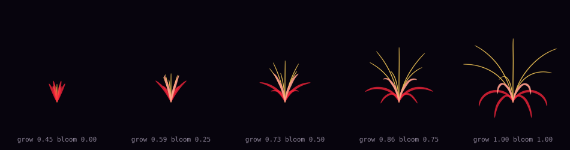

# GestureBloom

[](https://github.com/HenryRomeo1/gesturebloom/actions/workflows/ci.yml)


Real-time gesture-driven procedural flower. Hand landmarks from a webcam drive a
parametric spiderlily rendered on the GPU, with a temporal model that detects
gesture *events* rather than just classifying frames.



*Parametric geometry across the bloom range, rendered straight from
`geometry/spiderlily.py` — regenerate with `make preview`. Note that the tepal
tips recurve below the receptacle at full bloom, and that arc length is constant
across all five stages.*

<!-- TODO: add the live capture GIF above this line once the GL renderer is running:
     gesturebloom run --record-frames /tmp/frames --max-frames 480
     ffmpeg -framerate 60 -i /tmp/frames/frame_%05d.png -vf \
       "fps=24,scale=800:-1:flags=lanczos,split[a][b];[a]palettegen[p];[b][p]paletteuse" \
       -loop 0 assets/demo.gif -->

```bash
pip install -e .
python scripts/make_demo_recording.py --out data/examples/demo.npz
gesturebloom run --replay data/examples/demo.npz --headless
```

That runs the full pipeline with **no webcam, no GPU, and no training** — see
[Reproducibility](#reproducibility) for why that's the design centerpiece rather
than a convenience.

---

## What this actually is

Three things that are usually conflated in gesture-controlled art projects, kept
separate here because they're different problems:

| Layer | Problem | Approach |
|---|---|---|
| **Geometry** | Turn two scalars into a flower that looks alive | Arc-length integration of a curving unit tangent |
| **Control** | Turn a hand into two scalars, robustly, for *any* hand | Analytic canonicalization + per-user calibration + adaptive filtering |
| **Recognition** | Detect that a gesture *happened*, low-latency, in an unsegmented stream | Causal dilated TCN + hysteresis state machine |

The recognition layer is the machine learning. The control layer is where most of
the accuracy comes from. The geometry layer is where the visual quality comes
from. Conflating them is why so many of these projects end up as a pile of
hardcoded distance thresholds.

## The interesting problems

### Landmark canonicalization does the work a bigger model would otherwise do

MediaPipe returns landmarks in image-normalized coordinates. The same pose
produces wildly different vectors depending on hand position, camera distance,
and rotation. Train a classifier on raw landmarks and most of its capacity goes
to undoing those nuisance factors.

So they're removed analytically instead — translate to the wrist, scale by the
wrist→middle-MCP bone (a rigid bone, so it's pose-independent), rotate into a
palm-derived orthonormal frame, and mirror left hands into right-hand form.

The invariances are asserted as **property tests over randomized input**, not
spot-checked:

```python
# tests/test_canonical.py
transformed = lm @ random_rotation(rng).T * rng.uniform(0.2, 8.0) + rng.uniform(-20, 20, 3)
np.testing.assert_allclose(canonicalize(lm)[0], canonicalize(transformed)[0], atol=1e-9)
```

Holds to ~1e-16 in practice. The payoff: the pose classifier is a 40k-parameter
MLP, and chirality normalization doubles the effective dataset for free.

### Gesture spotting is not gesture classification

A frame classifier can tell you the hand *is* pinching. It can't tell you the
user *just pinched*, because that's an event with an onset, and onset is a
property of a trajectory. Detecting events in an unsegmented stream is a
different problem with different hard parts:

- Most frames belong to no gesture, so the negative class dominates heavily
- Latency is part of the objective — a detector that fires 400 ms late is useless
  regardless of accuracy
- Annotators disagree about onset frames by several frames

**Causal dilated TCN.** Dilations 1/2/4/8 give a 31-frame receptive field at
fixed per-frame cost. Causal (left-only) padding means the model never sees the
future, so offline metrics equal online behaviour — with a bidirectional model
your eval numbers are a lie. Chosen over CTC because frame-wise labels plus a
state machine is dramatically easier to debug: when it misfires you look at the
probability trace and see why.

**Soft onset targets.** Instead of hard 0/1 frame labels, the target ramps over
±3 frames around each annotated onset. This encodes the annotation ambiguity that
actually exists in the data instead of forcing the model to commit to a boundary
it can't see.

**Hysteresis state machine.** Thresholding the probability trace at 0.5 produces
chatter, double-fires, and class flapping. Three mechanisms, each targeting one
failure mode, each with its own test:

| Mechanism | Failure it prevents |
|---|---|
| Two thresholds (enter 0.65 / exit 0.40) | Chatter near the boundary |
| Onset persistence (3 consecutive frames) | Single-frame noise spikes |
| Refractory period (12 frames) | Double-fires from mid-gesture dips |

It's pure numpy with no torch dependency, so thresholds are tuned offline against
a recorded trace — `gesturebloom tune` grid-searches hundreds of combinations in
seconds. Never tune these against a live webcam.

**Metrics are event-level.** Precision, recall, F1, and median detection latency,
computed through the real state machine on held-out *recordings*. Frame accuracy
is reported only to show how misleading it is — a model predicting background
forever scores above 90%.

### Continuous control is regression, and it needs calibration

`grow` and `bloom` aren't discrete states, so binning them into classes produces
visible stepping. They're continuous regressions from geometric measures
(fingertip spread, pinch aperture, interphalangeal flexion, palm orientation).

Hand-span normalization removes camera distance but *not anatomy* —
finger-length-to-palm-length ratio varies enough between people that a fixed
threshold feels great for its author and bad for everyone else. Hence a
20-second guided calibration that takes **robust percentiles** (5th/95th over
several hundred frames) rather than min/max, which a single garbage frame would
otherwise set.

### Adaptive filtering, not an EMA

Landmarks jitter a few pixels frame to frame. An EMA trades jitter for lag at a
fixed ratio, forcing a choice between a shimmering render and an unresponsive
one. The One Euro filter makes cutoff frequency a function of estimated velocity
— aggressive smoothing when still, almost none when moving fast. Two intuitive
parameters, tuned in a fixed order (`min_cutoff` on a still hand, then `beta` on
a fast gesture).

### Growth is arc length; bloom is curvature

Both animation properties are geometric invariants, and both are enforced by
tests because breaking either stops the flower reading as a flower.

Scaling a finished tepal up from zero looks like a zoom. Real growth extends the
tip while the base stays put — so each strand integrates a unit tangent along arc
length `s`, and `grow` sets the upper limit of integration. The base is
*identical* at every growth stage.

Tepals recurve by bending, not hinging — so `bloom` drives the curvature `κ` of
the tangent's elevation. Because the tangent is unit length, **bending cannot
stretch the tepal**:

```python
# tests/test_geometry.py — arc length invariant under bloom to 1e-3
assert abs(arclength(build(1.0, bloom)) - arclength(build(1.0, 0.0))) < 1e-3
```

Stamens are held back until bloom passes a threshold, so the flower opens *then*
pushes its stamens out. Reading as a sequence rather than a single blend is most
of what makes it feel organic.

## Reproducibility

The `.npz` landmark recording format is the design centerpiece, and it's the
thing most projects in this space lack.

Webcam-driven projects are irreproducible. A bug at a particular hand angle can't
be re-triggered. Tests can't run in CI. Two runs of the "same experiment" differ
because your hand differed. Threshold tuning becomes an afternoon of waving at a
laptop.

Making the landmark stream a serializable first-class artifact fixes all of it.
Capture once; everything downstream runs from the file, identically, forever.

- `--replay PATH` works on **every** command
- **97 tests** run with no camera, no GPU, no display — including full
  pipeline, determinism, and geometry-to-vertex-buffer tests
- CI exercises the complete pipeline on three Python versions
- Dropped frames are `NaN`, never zeroed — a zeroed frame becomes "hand at the
  origin" and produces a plausible-looking wrong answer

A test worth highlighting, because bounds checks alone don't catch it:

```python
def test_signals_actually_vary():
    """A mapper bug that pins a parameter to 0 passes every bounds check
    while making the project completely non-interactive."""
    assert values.std() > 0.02
```

## Latency

Interactive systems are judged on latency, not throughput — a pipeline can hold
60 fps while adding 100 ms of delay through buffering. This table is generated by
`make bench`, not hand-written.

<!-- BEGIN: generated by `gesturebloom bench` -->
**Camera-free stages, synthetic 60 fps stream (CPU, containerized x86_64)**

| Stage | mean (ms) | p50 (ms) | p95 (ms) |
|---|---:|---:|---:|
| landmark | 0.03 | 0.03 | 0.05 |
| canonical | 0.10 | 0.09 | 0.14 |
| control | 0.27 | 0.25 | 0.40 |
| geometry | 2.83 | 2.71 | 3.90 |
| **end-to-end** | **3.23** | **3.10** | **4.42** |

Achieved 322.4 fps at the median frame time.
<!-- END generated -->

**p95, not mean** — frame-time distributions are right-skewed and the tail is
what users feel. A 6 ms mean with a 40 ms p95 stutters visibly; an 11 ms mean
with a 13 ms p95 feels smooth.

Two honest notes. This excludes MediaPipe inference and GL submission, which
dominate on real hardware (expect 8–15 ms for landmarks on CPU) — the table
measures the stages that are pure computation, so it works as a regression test
in CI. And **geometry is 88% of the measured cost**, all of it CPU-side
`ribbonize`. That's the obvious optimization target: move it to a geometry shader
if you scale past a few flowers. Reporting a real bottleneck is more useful than
hiding it.

## Usage

```bash
# Guided per-user calibration (20 seconds)
gesturebloom calibrate --out calibration.json

# Record labelled training data; keys 0-N set the active label
gesturebloom record --out data/pinch_01.npz --labels pinch spread swipe

# Train
gesturebloom train pose     --data data/ --epochs 60
gesturebloom train temporal --data data/ --epochs 80

# Grid-search spotter thresholds offline against a recorded trace
gesturebloom tune --probs traces/val.npz --truth traces/val_onsets.json

# Run
gesturebloom run --calibration calibration.json
gesturebloom run --replay data/examples/demo.npz --headless

# Export and verify
gesturebloom export checkpoints/pose_mlp.pt --out models/pose.onnx --task pose
```

### Install

Base install is numpy + pyyaml only, so `pip install gesturebloom` never pulls a
2 GB torch wheel on someone who just wants to read the geometry code.

```bash
pip install -e .              # core: geometry, control, spotter, replay
pip install -e '.[live]'      # + mediapipe, opencv  (webcam)
pip install -e '.[render]'    # + moderngl           (GPU render)
pip install -e '.[train]'     # + torch              (training)
pip install -e '.[all,dev]'   # everything
```

## Data collection notes

Everything below was learned the expensive way and matters more than
hyperparameters:

- **Multiple takes per pose, in separate files.** Splits are made at the
  *recording* level, because 32-frame windows at stride 4 share 28 of 32 frames —
  shuffle-splitting windows puts your test set in your training set and your
  reported accuracy becomes fiction. `split_recordings` enforces this. If all
  data for a class lives in one file, that class lands entirely in one split.
- **Vary lighting, distance, and background across takes**, not within.
- **Record the transitions,** not just held poses. The temporal model learns
  onsets, and onsets only exist in transitions.
- **Check `tracking_ratio` before training.** Below ~0.90, fix your lighting
  rather than a hyperparameter.
- **Class-weight from the *windowed* distribution.** A gesture in 5% of frames
  can occupy 30% of windows. Use `sqrt` inverse frequency — full inverse
  frequency over-corrects badly and the model starts firing constantly.

## Architecture

See [ARCHITECTURE.md](ARCHITECTURE.md) for the data flow, module boundaries, and
the reasoning behind each dependency being optional.

```
src/gesturebloom/
├── landmarks/     canonicalization, One Euro filtering, capture sources
├── control/       raw signal extraction, calibration, parameter mapping  ← shared
├── models/        pose MLP, causal TCN, onset spotter, ONNX export
├── geometry/      parametric spiderlily
├── render/        moderngl renderer + GLSL (bloom, tone mapping)
├── data/          recording format, replay, windowed datasets
└── bench/         per-stage latency instrumentation
```

`control/` is deliberately generic — it emits *named normalized scalars*, not
flower parameters, so a second project can bind the same signals to entirely
different render parameters without touching this code.

## Roadmap

- Two-handed interaction — the control abstraction supports it; capture defaults
  to one hand because tracking two roughly doubles the dominant latency stage
- `ribbonize` in a geometry shader, to fix the bottleneck the benchmark exposes
- Gesture-triggered discrete events (spotter → petal burst) wired to the render
- TouchDesigner integration as a thin OSC layer under `integrations/`, keeping
  the core pip-installable (`.toe` files are opaque binaries — they can't be
  diffed or reviewed, so they belong in release assets, not the repo)

## Credits

Inspired by [@cupidbity](https://instagram.com/cupidbity)'s TouchDesigner
spiderlily gesture work. Independent implementation with a different
architecture — Python/GLSL core, ML-based temporal gesture spotting, and the
reproducible recording pipeline.

- One Euro filter: Casiez, Roussel & Vogel, CHI 2012
- Dilated TCN: Bai, Kolter & Koltun, 2018
- Hand landmarks: MediaPipe HandLandmarker

## License

MIT
